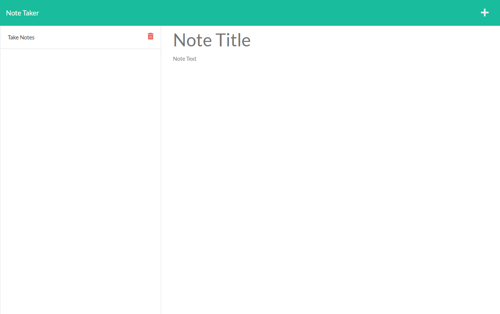

# Note Taker

## Description

This web application will generate and save notes based on user inputs.  The notes are hosted in a database and will persist.

## Table of Contents
  * [Installation](#installation)
  * [Usage](#usage)
  * [Questions](#questions)
  * [License](#license)
    
    
## Installation
    
  _Follow these steps to install this application:_

  Navigate to the live URL.
      
## Usage

  _Instructions for use:_

  Save notes with the save icon.  Delete notes with the trash icon.  Start a new note without saving the current note with the plus icon.
  
  
        
  [Link to deployed project](https://note-taker-alextheshire.herokuapp.com/)  
## Questions
      
  If you have any questions, please reach out via Github or my email.
  
  _Contact Info:_

  GitHub: [alextheshire](https://github.com/alextheshire)

  Email: [aalexbberes@gmail.com](mailto:aalexbberes@gmail.com)
    
## License

      
  _This application has the MIT License._
      
  For more information please view the [license description](https://choosealicense.com/licenses/MIT).
  
  
